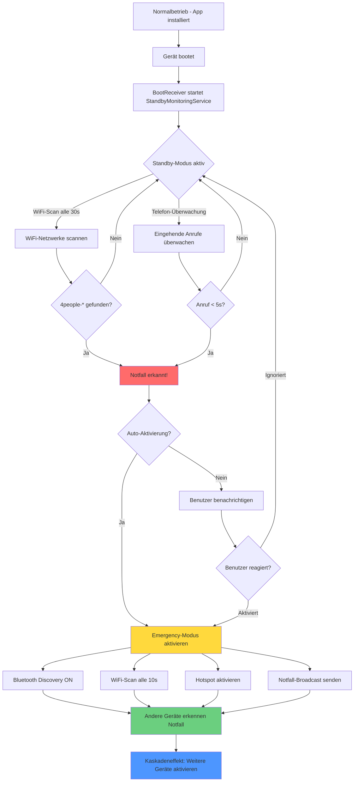
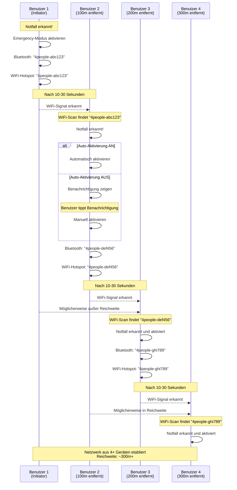
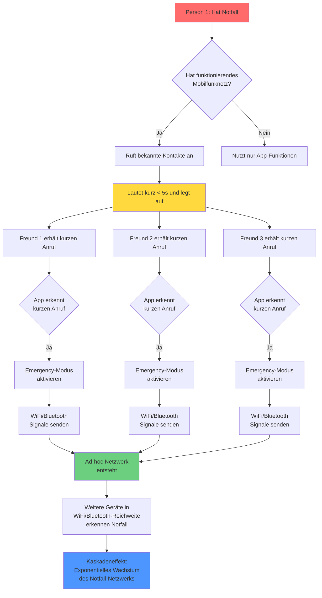
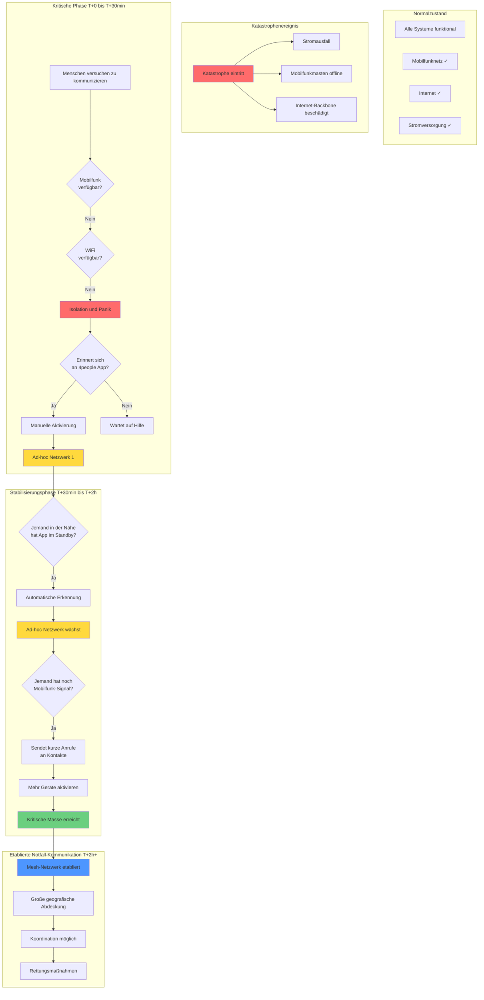
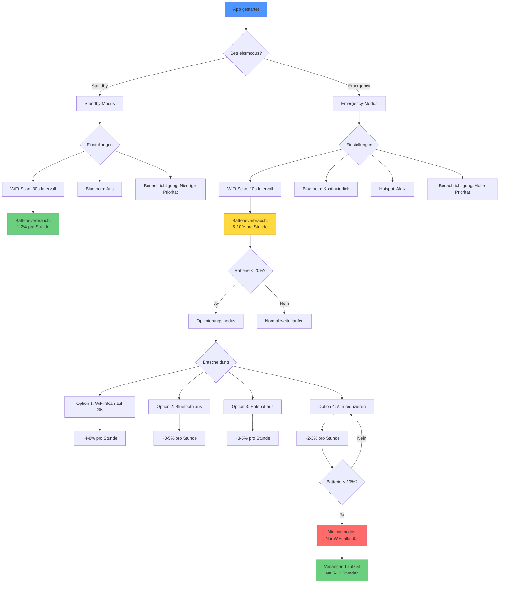
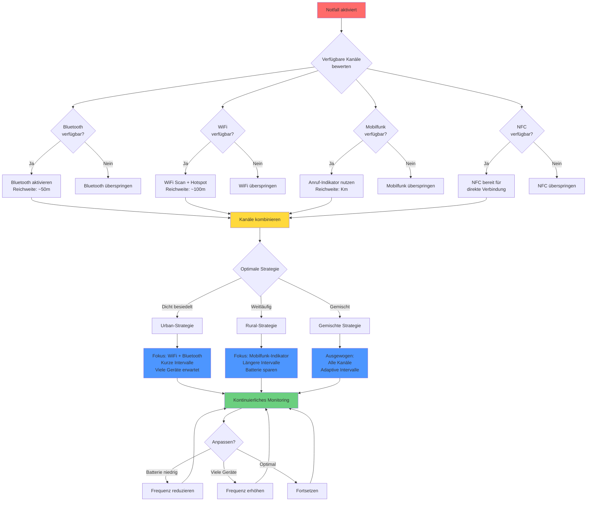

# Notfall-Szenarien und Ablaufdiagramme

## Übersicht

Dieses Dokument beschreibt detailliert mögliche Notfallszenarien, in denen die 4people-App zum Einsatz kommt, analysiert alle verfügbaren Mobiltelefonfunktionen für die Notkommunikation und betrachtet kritische Aspekte der Implementierung.

## Inhaltsverzeichnis

1. [Mögliche Notfallszenarien](#mögliche-notfallszenarien)
2. [Verfügbare Kommunikationsmittel](#verfügbare-kommunikationsmittel)
3. [Detaillierte Ablaufdiagramme](#detaillierte-ablaufdiagramme)
4. [Kritische Aspekte](#kritische-aspekte)
5. [Verbesserungsvorschläge](#verbesserungsvorschläge)

---

## Mögliche Notfallszenarien

### Szenario 1: Naturkatastrophe (Erdbeben, Überschwemmung)
**Kontext:**
- Stromausfall in großem Gebiet
- Mobilfunkmasten ohne Strom oder beschädigt
- Kabelgebundenes Internet ausgefallen
- Menschen suchen nach Angehörigen
- Koordination von Rettungsmaßnahmen erforderlich

**Herausforderungen:**
- Begrenzte Batterielaufzeit der Geräte
- Große geografische Verteilung der Betroffenen
- Panik und Stress der Nutzer
- Möglicherweise keine vorherige Installation der App

### Szenario 2: Terroranschlag oder Großbrand
**Kontext:**
- Plötzlicher Ausfall der Infrastruktur in begrenztem Gebiet
- Hohe Konzentration von Menschen auf engem Raum
- Netzüberlastung durch Massenanrufe
- Schnelle Reaktion erforderlich

**Herausforderungen:**
- Schnelle Aktivierung und Verbreitung erforderlich
- Mögliche Interferenzen durch viele Geräte
- Authentizität der Notfallmeldungen
- Vermeidung von Panik durch Fehlinformationen

### Szenario 3: Politische Krise oder Cyber-Angriff
**Kontext:**
- Gezielte Abschaltung der Kommunikationsinfrastruktur
- Zensur oder Überwachung der Kommunikation
- Notwendigkeit vertraulicher Kommunikation
- Längere Dauer des Ausfalls

**Herausforderungen:**
- Mögliche aktive Störversuche
- Sicherheit und Verschlüsselung
- Langfristige Batterieverwaltung
- Vertrauenswürdigkeit des Netzwerks

### Szenario 4: Abgelegenes Gebiet ohne Infrastruktur
**Kontext:**
- Wandergruppe oder Expedition in abgelegener Region
- Kein Mobilfunknetz verfügbar
- Notfall erfordert Koordination der Gruppe
- Begrenzte Anzahl von Geräten

**Herausforderungen:**
- Große Distanzen zwischen Gruppenmitgliedern
- Topografische Hindernisse (Berge, Täler)
- Wettereinflüsse auf Signalqualität
- Minimale Infrastruktur für Mesh-Netzwerk

---

## Verfügbare Kommunikationsmittel

### Aktuell implementiert:

1. **Bluetooth**
   - ✅ Reichweite: ~10-100m (je nach Gerät und Umgebung)
   - ✅ Energieeffizient
   - ✅ Keine Internetverbindung erforderlich
   - ✅ Geräte-Discovery und Advertising

2. **WiFi-Scanning**
   - ✅ Reichweite: ~50-100m
   - ✅ Erkennung von Notfall-Netzwerken (4people-* Pattern)
   - ✅ Periodisches Scannen (10s aktiv, 30s Standby)

3. **WiFi-Hotspot**
   - ✅ Lokales Netzwerk zur Signalisierung
   - ⚠️ Eingeschränkt auf Android 8+ (LocalOnlyHotspot)
   - ✅ Automatische Erkennung durch Pattern

4. **Telefon-Anruf-Indikator**
   - ✅ Kurze Anrufe (< 5 Sekunden) als Notfallsignal
   - ✅ Funktioniert ohne Datenverbindung
   - ✅ Hohe Reichweite über Mobilfunknetz

### Potenzielle zusätzliche Mittel:

5. **SMS/MMS**
   - 📱 Oft verfügbar wenn Sprachdienst nicht funktioniert
   - 📱 Kann als Broadcast-Medium genutzt werden
   - ⚠️ Erfordert teilweise funktionierendes Mobilfunknetz
   - 💡 Vorschlag: Notfall-SMS an vorher festgelegte Kontakte

6. **WiFi Direct**
   - 📱 Peer-to-Peer ohne Router
   - 📱 Höhere Geschwindigkeit als Bluetooth
   - 📱 Reichweite ähnlich wie WiFi
   - 💡 Vorschlag: Implementierung für direkte Gerätekopplung

7. **NFC (Near Field Communication)**
   - 📱 Sehr kurze Reichweite (< 10cm)
   - 📱 Tap-to-Connect für schnelle Konfiguration
   - 📱 Energieeffizient
   - 💡 Vorschlag: Schnelle Netzwerkbeitritt durch NFC-Touch

8. **Ultraschall-Audio**
   - 📱 Datenübertragung über unhörbare Frequenzen
   - 📱 Funktioniert auch bei gesperrten Geräten
   - 📱 Reichweite: ~5-10m
   - 💡 Vorschlag: Alternative Signalisierungsmethode

9. **Kamera/QR-Codes**
   - 📱 Visueller Informationsaustausch
   - 📱 Konfigurationsübertragung
   - 📱 Große Datenmenge möglich
   - 💡 Vorschlag: QR-Code für Netzwerkbeitritt

10. **Taschenlampen-Signale**
    - 📱 Morse-Code oder Blinkmuster
    - 📱 Sichtbare Reichweite bis zu mehreren hundert Metern
    - 📱 Sehr energieeffizient
    - 💡 Vorschlag: LED-basierte Notfallsignalisierung

11. **Vibrationsmuster**
    - 📱 Haptisches Feedback als Signalisierung
    - 📱 Unauffällige Kommunikation
    - 💡 Vorschlag: Kodierte Vibrationsmuster für diskrete Signale

12. **Bildschirm-Helligkeit/Farbe**
    - 📱 Visuelles Signalisierungsmittel
    - 📱 Große Sichtweite
    - 💡 Vorschlag: Farbkodierte Notfallsignale

---

## Detaillierte Ablaufdiagramme

### 1. Grundlegender Notfall-Aktivierungs-Ablauf



### 2. Kaskaden-Aktivierungs-Szenario (Netzwerkeffekt)



### 3. Telefon-Anruf-Indikator Propagierung



### 4. Infrastruktur-Ausfall-Szenario



### 5. Batterie-Optimierungs-Entscheidungsbaum



### 6. Sicherheits- und Falsch-Positiv-Szenario

```mermaid
graph TD
    Signal[Signal empfangen] --> Type{Signal-Typ}
    
    Type -->|WiFi Pattern| WiFiCheck[WiFi: "4people-*" erkannt]
    Type -->|Kurzer Anruf| CallCheck[Anruf < 5s erkannt]
    Type -->|Bluetooth| BTCheck[Bluetooth: "4people-*" erkannt]
    
    WiFiCheck --> WiFiValid{Plausibilitätsprüfung}
    CallCheck --> CallValid{Plausibilitätsprüfung}
    BTCheck --> BTValid{Plausibilitätsprüfung}
    
    WiFiValid -->|Pass| WiFiLegit[Wahrscheinlich legitim]
    WiFiValid -->|Fail| WiFiFalse[Möglicher Fehlalarm]
    
    CallValid -->|Pass| CallLegit[Wahrscheinlich legitim]
    CallValid -->|Fail| CallFalse[Möglicher Fehlalarm]
    
    BTValid -->|Pass| BTLegit[Wahrscheinlich legitim]
    BTValid -->|Fail| BTFalse[Möglicher Fehlalarm]
    
    WiFiFalse --> UserNotif1[Benutzer benachrichtigen]
    CallFalse --> UserNotif2[Benutzer benachrichtigen]
    BTFalse --> UserNotif3[Benutzer benachrichtigen]
    
    WiFiLegit --> AutoCheck1{Auto-Aktivierung?}
    CallLegit --> AutoCheck2{Auto-Aktivierung?}
    BTLegit --> AutoCheck3{Auto-Aktivierung?}
    
    AutoCheck1 -->|Ja| MultiSignal1{Mehrere Signale?}
    AutoCheck2 -->|Ja| MultiSignal2{Mehrere Signale?}
    AutoCheck3 -->|Ja| MultiSignal3{Mehrere Signale?}
    
    MultiSignal1 -->|Ja| HighConfidence[Hohe Konfidenz:<br/>Sofort aktivieren]
    MultiSignal1 -->|Nein| Delay1[5s Verzögerung]
    
    MultiSignal2 -->|Ja| HighConfidence
    MultiSignal2 -->|Nein| Delay2[5s Verzögerung]
    
    MultiSignal3 -->|Ja| HighConfidence
    MultiSignal3 -->|Nein| Delay3[5s Verzögerung]
    
    Delay1 --> Recheck1{Noch vorhanden?}
    Delay2 --> Recheck2{Noch vorhanden?}
    Delay3 --> Recheck3{Noch vorhanden?}
    
    Recheck1 -->|Ja| Activate
    Recheck1 -->|Nein| FalseAlarm[Fehlalarm vermieden]
    
    Recheck2 -->|Ja| Activate
    Recheck2 -->|Nein| FalseAlarm
    
    Recheck3 -->|Ja| Activate
    Recheck3 -->|Nein| FalseAlarm
    
    HighConfidence --> Activate[Emergency-Modus aktivieren]
    
    UserNotif1 --> UserDecision{Benutzer entscheidet}
    UserNotif2 --> UserDecision
    UserNotif3 --> UserDecision
    
    UserDecision -->|Aktiviert| Activate
    UserDecision -->|Ignoriert| Ignored[Ignoriert - Standby fortsetzen]
    
    style WiFiFalse fill:#ff6b6b
    style CallFalse fill:#ff6b6b
    style BTFalse fill:#ff6b6b
    style FalseAlarm fill:#6bcf7f
    style HighConfidence fill:#4d96ff
    style Activate fill:#ffd93d
```

### 7. Multi-Kanal-Kommunikations-Strategie



### 8. Zeitlicher Verlauf eines Notfalls

```mermaid
gantt
    title Zeitlicher Ablauf: Notfall-Aktivierung und Netzwerk-Bildung
    dateFormat HH:mm
    axisFormat %H:%M
    
    section Initiierung
    Katastrophe eintritt              :crit, t0, 00:00, 1m
    Erste Person erkennt Problem      :crit, t1, 00:01, 2m
    Manuelle App-Aktivierung          :active, t2, 00:03, 1m
    
    section Erste Welle (0-10 Min)
    Bluetooth Broadcasting            :b1, 00:04, 30m
    WiFi Hotspot aktiv                :w1, 00:04, 30m
    Erste Geräte erkennen Signal      :00:05, 5m
    Auto-Aktivierung (2-3 Geräte)     :active, 00:10, 3m
    
    section Zweite Welle (10-30 Min)
    Kaskadeneffekt beginnt            :active, 00:13, 17m
    5-10 Geräte im Netzwerk           :00:15, 15m
    Anruf-Indikatoren gesendet        :00:20, 10m
    Geografische Ausbreitung          :00:20, 10m
    
    section Kritische Masse (30-60 Min)
    20+ Geräte aktiv                  :crit, 00:30, 30m
    Mesh-Netzwerk etabliert           :milestone, 00:35, 0m
    Stabile Kommunikation             :00:35, 25m
    
    section Stabilisierung (1-2 Std)
    50+ Geräte im Netzwerk            :01:00, 60m
    Redundante Verbindungen           :01:00, 60m
    Koordination möglich              :01:15, 45m
    
    section Langzeit-Betrieb (2+ Std)
    Batterie-Optimierung              :02:00, 120m
    Rettungsmaßnahmen koordiniert     :02:30, 90m
```



---

## Kritische Aspekte

### 1. Sicherheit und Datenschutz

#### Aktuelle Situation:
- ❌ Keine Verschlüsselung der Kommunikation
- ✅ Keine persönlichen Daten in Discovery-Phase
- ✅ Broadcasts auf App-Paket beschränkt
- ⚠️ Geringe Authentifizierung

#### Kritische Überlegungen:
1. **Man-in-the-Middle-Angriffe**: Böswillige Akteure könnten gefälschte 4people-Netzwerke erstellen
2. **Spam/DoS**: Massive Falsch-Positive könnten System überlasten
3. **Abhören**: Unverschlüsselte Kommunikation kann abgefangen werden
4. **Impersonation**: Keine Verifikation der Benutzeridentität

#### Empfehlungen:
- 🔒 Ende-zu-Ende-Verschlüsselung implementieren
- 🔑 Public-Key-Infrastruktur für Authentifizierung
- 🛡️ Reputation-System für vertrauenswürdige Geräte
- ⚠️ Warnung bei unbekannten Netzwerken

### 2. Batterieverbrauch

#### Aktuelle Situation:
- Standby: ~1-2% pro Stunde
- Emergency: ~5-10% pro Stunde
- Keine dynamische Anpassung basierend auf Batteriestand

#### Kritische Überlegungen:
1. **Langzeit-Notfälle**: Bei mehrtägigen Infrastrukturausfällen ist Batterie kritisch
2. **Trade-off**: Weniger Scanning = längere Batterie, aber langsamere Erkennung
3. **Unterschiedliche Geräte**: Ältere Geräte haben kleinere Batterien
4. **Simultane Nutzung**: Benutzer verwenden möglicherweise auch andere Apps

#### Empfehlungen:
- 🔋 Adaptiver Batterie-Modus: Bei < 20% automatisch reduzieren
- 📊 Batterie-Monitoring-Dashboard
- ⚡ Peer-to-Peer Relay: Geräte mit guter Batterie übernehmen mehr Last
- 🌙 Nacht-Modus: Reduzierte Aktivität in Ruhephasen

### 3. Reichweite und Abdeckung

#### Aktuelle Situation:
- Bluetooth: ~50m effektive Reichweite
- WiFi: ~100m effektive Reichweite
- Kein echtes Mesh-Netzwerk, nur Discovery

#### Kritische Überlegungen:
1. **Urbane Gebiete**: Viele Hindernisse (Gebäude, Wände)
2. **Ländliche Gebiete**: Große Distanzen zwischen Nutzern
3. **Topografie**: Berge, Täler reduzieren Signalreichweite
4. **Skalierung**: Bei vielen Geräten mögliche Interferenzen

#### Empfehlungen:
- 🔁 Echtes Mesh-Networking mit Routing
- 📡 Signal-Verstärkung durch Relay-Nodes
- 🗺️ Geografisches Clustering für Effizienz
- 📶 Signal-Stärke-Indikatoren für Benutzer

### 4. Benutzerfreundlichkeit im Notfall

#### Aktuelle Situation:
- App muss vorher installiert sein
- Benutzer muss sich an App erinnern
- Komplexe Berechtigungen erforderlich

#### Kritische Überlegungen:
1. **Stresssituation**: Nutzer können nicht klar denken
2. **Technische Kompetenz**: Nicht alle Nutzer sind technisch versiert
3. **App-Bewusstsein**: Geringe Adoption ohne aktiven Notfall
4. **Onboarding**: Zu kompliziert in Notfallsituation

#### Empfehlungen:
- 🚨 Notfall-Button auf Sperrbildschirm (Android-Widget)
- 📱 Shake-to-Activate: Gerät schütteln zur Aktivierung
- 🎓 Interaktives Tutorial für Nicht-Notfall-Zeiten
- 🔔 Periodische Erinnerungen zur App-Existenz

### 5. Falsch-Positive und Fehlalarme

#### Aktuelle Situation:
- WiFi-Pattern kann zufällig übereinstimmen
- Kurze Anrufe können legitime Gründe haben
- Keine Verifikation der Notfall-Legitimität

#### Kritische Überlegungen:
1. **WiFi-Namenskollision**: Jemand könnte zufällig "4people-xyz" nennen
2. **Versehentliche Anrufe**: Pocket-Dialing oder Fehlwahl
3. **Test-Aktivierungen**: Nutzer testen App ohne echten Notfall
4. **Panik-Induktion**: Zu viele Fehlalarme reduzieren Vertrauen

#### Empfehlungen:
- ✅ Multi-Signal-Verifikation: Mindestens 2 verschiedene Indikatoren
- ⏱️ Verzögerung vor Auto-Aktivierung mit Abbruch-Option
- 📊 Historische Daten: Lernender Algorithmus für Muster
- 🔔 Unterschiedliche Benachrichtigungsstufen basierend auf Konfidenz

### 6. Rechtliche und regulatorische Aspekte

#### Kritische Überlegungen:
1. **Frequenzregulierung**: WiFi/Bluetooth-Nutzung ist reguliert
2. **Notfall-Broadcasting**: Möglicherweise spezielle Genehmigungen erforderlich
3. **Datenschutzgesetze**: DSGVO-Konformität bei Standortdaten
4. **Haftung**: Verantwortung bei Fehlern oder Missbrauch
5. **Störung anderer Dienste**: Keine Interferenz mit Rettungsdiensten

#### Empfehlungen:
- ⚖️ Rechtliche Beratung einholen
- 📜 Klare Nutzungsbedingungen
- 🔐 Datenschutz-by-Design
- ⚠️ Disclaimer über Nutzungsrisiken

### 7. Skalierbarkeit und Performance

#### Kritische Überlegungen:
1. **Geräte-Dichte**: Hunderte Geräte in kleinem Bereich
2. **Signalüberlappung**: Zu viele WiFi-Hotspots stören sich gegenseitig
3. **Broadcast-Stürme**: Kaskadeneffekt kann außer Kontrolle geraten
4. **Ressourcen-Erschöpfung**: CPU, Speicher, Batterie

#### Empfehlungen:
- 🎯 Intelligentes Backoff: Geräte reduzieren Aktivität bei hoher Dichte
- 🔀 Randomisierung: Scan-Intervalle leicht variieren zur Vermeidung von Kollisionen
- 📊 Netzwerk-Topologie-Erkennung: Geräte organisieren sich hierarchisch
- 💾 Ressourcen-Monitoring: Automatische Anpassung bei Überlastung

### 8. Interoperabilität

#### Kritische Überlegungen:
1. **Android-Versionen**: Unterschiedliche API-Verfügbarkeit
2. **Hersteller-Einschränkungen**: Samsung, Huawei haben eigene Regeln
3. **Andere Plattformen**: iOS, Feature-Phones nicht unterstützt
4. **Andere Apps**: Konflikt mit ähnlichen Apps möglich

#### Empfehlungen:
- 🔄 Fallback-Modi für ältere Android-Versionen
- 🍎 iOS-Version entwickeln
- 🌐 Offenes Protokoll: Ermöglicht Drittanbieter-Implementierungen
- 🤝 Standard definieren: RFC oder ähnlich für Interoperabilität

---

## Verbesserungsvorschläge

### Kurzfristig umsetzbar (1-3 Monate):

#### 1. SMS-Notfall-Broadcast
**Beschreibung**: Bei Aktivierung werden vorher festgelegte Kontakte per SMS benachrichtigt.

**Vorteile**:
- SMS oft verfügbar, wenn Datennetz nicht funktioniert
- Große Reichweite über Mobilfunknetz
- Keine App-Installation bei Empfängern erforderlich

**Implementierung**:
```kotlin
// Pseudo-Code
fun sendEmergencySMS() {
    val emergencyContacts = getEmergencyContacts()
    val message = "NOTFALL! 4people-App aktiviert. Standort: ${getLocation()}"
    
    emergencyContacts.forEach { contact ->
        sendSMS(contact.phoneNumber, message)
    }
}
```

**Kritische Überlegungen**:
- Kosten für SMS
- Spam-Potential
- Datenschutz

#### 2. WiFi Direct Integration
**Beschreibung**: Nutze WiFi Direct für schnellere, direkte Peer-to-Peer-Verbindungen.

**Vorteile**:
- Höhere Geschwindigkeit als Bluetooth
- Größere Reichweite
- Standard Android-Feature

**Implementierung**:
- WifiP2pManager API nutzen
- Service Discovery für automatische Erkennung
- Fallback auf normales WiFi wenn nicht verfügbar

#### 3. Adaptive Scan-Intervalle
**Beschreibung**: Dynamische Anpassung der Scan-Frequenz basierend auf Batterie und Aktivität.

**Logik**:
```
Batterie > 50%: Alle 10s (Emergency) / 30s (Standby)
Batterie 20-50%: Alle 20s (Emergency) / 60s (Standby)
Batterie 10-20%: Alle 40s (Emergency) / 120s (Standby)
Batterie < 10%: Alle 60s (Emergency) / 300s (Standby)
```

#### 4. Notfall-Widget
**Beschreibung**: Home-Screen-Widget für Ein-Klick-Aktivierung.

**Vorteile**:
- Schnellerer Zugriff
- Keine App öffnen erforderlich
- Höhere Sichtbarkeit

### Mittelfristig umsetzbar (3-6 Monate):

#### 5. Mesh-Netzwerk mit Routing
**Beschreibung**: Echtes Mesh-Netzwerk, bei dem Nachrichten über mehrere Geräte geroutet werden.

**Funktionen**:
- Multi-Hop-Routing
- Automatische Route-Finding
- Lastverteilung
- Redundanz bei Geräteausfall

**Protokoll-Überlegungen**:
- AODV (Ad-hoc On-Demand Distance Vector)
- OLSR (Optimized Link State Routing)
- Oder eigenes, vereinfachtes Protokoll

#### 6. Ende-zu-Ende-Verschlüsselung
**Beschreibung**: Sichere Kommunikation zwischen Geräten.

**Ansatz**:
- Public-Key-Kryptografie (RSA/ECC)
- Session-Keys für Performance
- Signal-Protokoll ähnlich
- Schlüsseltausch über QR-Codes möglich

#### 7. Standort-Sharing
**Beschreibung**: Teilen von GPS-Koordinaten im Notfall-Netzwerk.

**Funktionen**:
- Automatische Standorterfassung
- Broadcast an alle Netzwerk-Teilnehmer
- Karte mit allen Teilnehmern
- Hilfe-Anfragen mit Standort

#### 8. Peer-to-Peer-Messaging
**Beschreibung**: Textnachrichten zwischen Geräten senden.

**Features**:
- Kurze Textnachrichten (< 256 Zeichen)
- Broadcast oder Unicast
- Store-and-Forward bei unterbrochener Verbindung
- Delivery-Bestätigung

### Langfristig umsetzbar (6-12 Monate):

#### 9. Offline-Karten Integration
**Beschreibung**: Integrierte Karten für Navigation ohne Internet.

**Funktionen**:
- OSM-basierte Offline-Karten
- Anzeige aller Netzwerk-Teilnehmer
- Sammlungspunkte markieren
- Routen zu Sicherheitszonen

#### 10. Sprach-Kommunikation
**Beschreibung**: VoIP über Ad-hoc-Netzwerk.

**Herausforderungen**:
- Bandbreite-Anforderungen hoch
- Latenz kritisch
- Codec-Optimierung erforderlich

**Ansatz**:
- Opus Codec (sehr effizient)
- Push-to-Talk (PTT) Modus
- Niedrige Bitrate (8-16 kbps)

#### 11. Multi-Plattform Support
**Beschreibung**: iOS, Web, Desktop-Versionen.

**Vorteil**:
- Größere Reichweite
- Mehr potenzielle Nutzer
- Cross-Platform-Netzwerke

**Technologie**:
- React Native oder Flutter für mobile
- WebRTC für Web
- Gemeinsames Protokoll

#### 12. KI-basierte Optimierung
**Beschreibung**: Machine Learning für intelligente Netzwerk-Optimierung.

**Anwendungen**:
- Vorhersage optimaler Scan-Intervalle
- Anomalie-Erkennung für Fehlalarme
- Netzwerk-Topologie-Optimierung
- Batterieverbrauch-Prognose

#### 13. Ultraschall-Signalisierung
**Beschreibung**: Datenübertragung über unhörbare Audio-Frequenzen.

**Vorteile**:
- Funktioniert auch bei gesperrten Geräten
- Kein Bluetooth/WiFi erforderlich
- Kann durch Wände gehen
- Geringe Energieanforderung

**Nachteile**:
- Geringe Bandbreite
- Störanfällig
- Kurze Reichweite

**Bibliotheken**:
- Chirp SDK
- Quietnet
- Eigene Implementierung möglich

#### 14. NFC Tap-to-Join
**Beschreibung**: Schneller Netzwerkbeitritt durch NFC-Touch.

**Ablauf**:
1. Person A hat Notfall-Netzwerk aktiv
2. Person B tippt Gerät an Gerät
3. Automatischer Austausch von Netzwerk-Credentials
4. Person B ist sofort im Netzwerk

#### 15. Taschenlampen-Morse-Code
**Beschreibung**: LED-basierte visuelle Signalisierung.

**Verwendung**:
- SOS-Signal bei aktivem Notfall
- Synchronisierte Blinkmuster zur Identifikation
- Größere Reichweite (bis zu 1km bei Sichtverbindung)
- Backup wenn alle anderen Methoden fehlen

**Implementierung**:
```kotlin
fun sendSOSSignal() {
    // S = ... (3 kurz)
    // O = --- (3 lang)
    // S = ... (3 kurz)
    repeat(3) { shortFlash() }
    delay(200)
    repeat(3) { longFlash() }
    delay(200)
    repeat(3) { shortFlash() }
}
```

---

## Zusammenfassung und Empfehlungen

### Prioritäten für nächste Schritte:

#### Höchste Priorität (Kritisch):
1. ✅ **Ende-zu-Ende-Verschlüsselung**: Sicherheit ist essentiell
2. ✅ **Adaptive Batterie-Verwaltung**: Notwendig für Langzeit-Nutzung
3. ✅ **Multi-Signal-Verifikation**: Reduziert Fehlalarme drastisch

#### Hohe Priorität (Sehr wichtig):
4. ✅ **Mesh-Routing**: Erweitert Reichweite erheblich
5. ✅ **SMS-Integration**: Nutzt existierende Infrastruktur
6. ✅ **WiFi Direct**: Verbessert Geschwindigkeit und Zuverlässigkeit

#### Mittlere Priorität (Wichtig):
7. ✅ **Peer-to-Peer-Messaging**: Kernfunktionalität für Kommunikation
8. ✅ **Standort-Sharing**: Kritisch für Koordination
9. ✅ **Offline-Karten**: Hilfreich für Navigation

#### Niedrige Priorität (Nice-to-have):
10. ⚪ **Sprach-Kommunikation**: Hohe Komplexität
11. ⚪ **Multi-Plattform**: Erhöht Reichweite
12. ⚪ **Alternative Signalisierung**: Experimentell

### Kritische Erfolgsfaktoren:

1. **Adoption**: App muss vorher installiert sein
   - Kampagnen in Gemeinden und Organisationen
   - Integration in bestehende Notfall-Apps
   - Einfaches Onboarding

2. **Zuverlässigkeit**: Muss im Notfall funktionieren
   - Umfangreiche Tests in Notfall-Simulationen
   - Robuste Fehlerbehandlung
   - Fallback-Mechanismen

3. **Batterielaufzeit**: Muss stundenlang laufen können
   - Kontinuierliche Optimierung
   - Benutzer-Feedback zu Verbrauch
   - Adaptive Strategien

4. **Sicherheit**: Darf nicht missbraucht werden
   - Security Audits
   - Penetration Testing
   - Community-Review

5. **Benutzerfreundlichkeit**: Muss einfach sein
   - Minimale Schritte zur Aktivierung
   - Klare Statusindikatoren
   - Intuitive Bedienung

### Messbare Ziele:

- **Erkennungszeit**: < 30 Sekunden bis erste Nachbarn aktiviert sind
- **Reichweite**: 300m+ durch Multi-Hop-Routing
- **Batterielaufzeit**: Minimum 12 Stunden im Emergency-Modus
- **Fehlalarm-Rate**: < 5% falsch-positive
- **Adoption**: 10,000+ Downloads im ersten Jahr

---

## Fazit

Die 4people-App hat ein solides Fundament für Ad-hoc-Notfallkommunikation geschaffen. Durch die vorgeschlagenen Verbesserungen kann sie zu einem robusten, zuverlässigen System für echte Notfälle werden.

Die größten Herausforderungen liegen in:
- **Sicherheit und Verschlüsselung**
- **Batterie-Effizienz bei Langzeitbetrieb**
- **Adoption und Bekanntheit der App**
- **Robustheit gegen Fehlalarme**

Die vielversprechendsten Erweiterungen sind:
- **Mesh-Netzwerk mit Routing** (größte Reichweite)
- **SMS-Integration** (nutzt existierende Infrastruktur)
- **WiFi Direct** (bessere Performance)
- **Ende-zu-Ende-Verschlüsselung** (essentiell für Sicherheit)

Mit kontinuierlicher Entwicklung und Community-Feedback kann die App ein wichtiges Werkzeug für Notfallsituationen werden, in denen traditionelle Kommunikationsinfrastruktur versagt.
